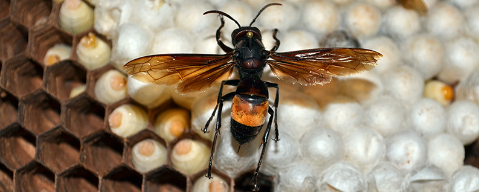
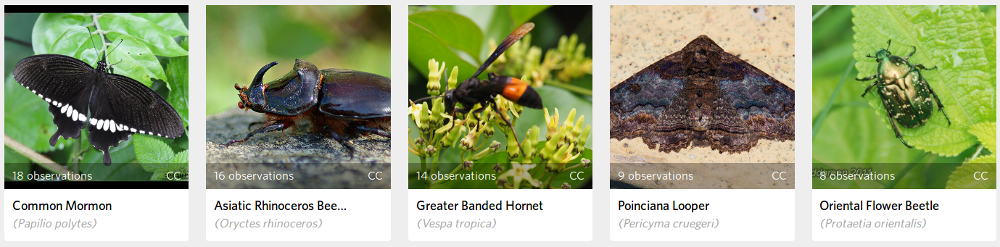
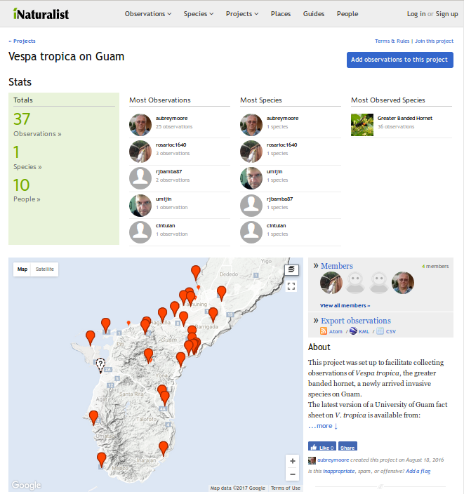

# What's that bug?: There's an app for that.

Want to know the name of that strange insect that just landed in front of you? There's free cell phone app for that
called [iNaturalist](https://www.inaturalist.org/). 

iNaturalist allows you to use your phone to snap pictures of any animals or plants and upload them to an online database connected to a global network
of nature lovers who are willing to help you identify them. Locations and times of the observations are recorded automatically.

Dr. Aubrey Moore, a UOG entomologist, has been using iNaturalist quite a bit lately for several different uses:

* When Moore is emailed photos of insects for identification, these are posted to an [iNaturalist project called *Insects of Micronesia*](https://www.inaturalist.org/projects/insects-of-micronesia) and a link 
to the identified images is emailed back to the client. The project is publicly available and can be used as a reference to identify many of Guam's most common insects.
* The *Insects of Micronesia* project is used by UOG students in Moore's entomology courses to document and help identify insects they collect. 
* iNaturalist projects can be used for insect surveys. For example iNaturalist was used to map the [spread of the greater banded hornet](https://www.inaturalist.org/projects/vespa-tropica-on-guam), a newly arrived invasive species. In another example, students in Dr. Curt Feidler's environmental biology course used an [iNaturalist project to map coconut rhinoceros beetle damage](https://www.inaturalist.org/projects/uog-bi-100l-coconut-tree-survey-sp-16). 

